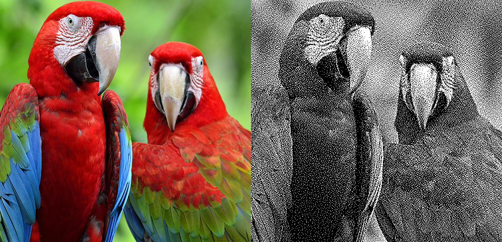

# Digital Halftoning with Space Filling Curves



This is an implementation of the digital halftoning technique introduced in the following article:

*Digital Halftoning with Space-Filling Curves* by Luiz Velho and Jonas de Miranda Gomes,
Special Interest Group on Computer Graphics and Interactive Techniques (SIGGRAPH), 1991

The authors introduced a technique for generating halftone images from grayscale images using space-filling curves, which is an alternative to the traditional artistic technique of stippling that places small dots of ink onto paper such that their density gives the impression of tone.

## Pre-requisites

This implementation has been written and tested on Ubuntu 22.04 using the following packages:

* OpenCV
* NumPy
* Matplotlib

## Usage

```
 usage: digital_halftoning.py [-h] [-i image_in] [-o image_out] [-t curve_type] [-s cluster_size]
                              [-d distribution] [-g gamma] [-b blur] [-w weight]

 options:
   -h, --help                                    show this help message and exit
   -i image_in, --image_in image_in              path to the input image
   -o image_out, --image_out image_out           path to the output image
   -t curve_type, --curve_type curve_type        type of space filling curve
   -s cluster_size, --cluster_size cluster_size  size of the cluster for halftoning
   -d distribution, --distribution distribution  within-cluster intensity distribution
   -g gamma, --gamma gamma                       gamma value for gamma correction
   -b blur, --blur blur                          blur value for edge enhancement
   -w weight, --weight weight                    weight value for edge enhancement
```
